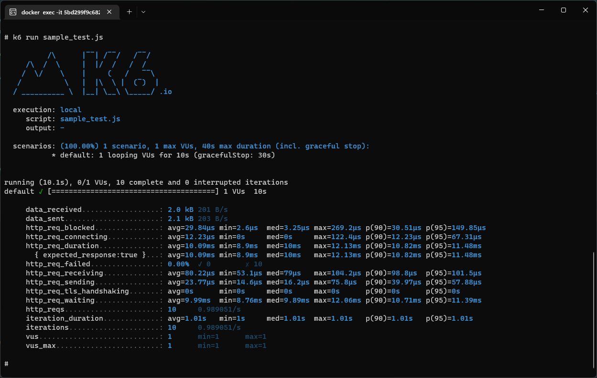
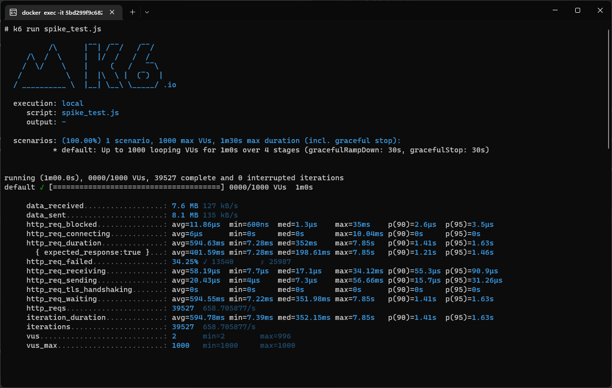

# BlockchainBackendProject

## Run with docker
```shell
docker-compose up
```

This will provide : 
 - An api exposing its endpoint to create a player and a wallet
 - A mock api to simulate the creation of a wallet on a blockchain which will be called by the other api
 - A postgres database to store created users and wallets

## Call endpoint
The endpoint is exposed on the port 5000 :
```
http://localhost:5000/
```

The only method supported is POST

Header to provide :
```
Content-Type : application/json
```

Example of body to provide :
```json
{
    "username" : "johndoe",
    "password" : "Foobar.1",
    "pin_code" : "123456"
}
```

## Response 
This endpoint will successfully respond with a body providing the name and the wallet address 
```json
{
    "username":"johndoe",
    "wallet_address":"1aec6b68-4918-4a24-9792-3756086c9925"
}
```

## Performance tests
k6 is installed on the Backend container and test scripts are provided

You can open a terminal on this container and run the tests

### Interact with container
```
docker exec -it containerAddress
```

### Run tests
```
k6 run sample_test.js
```

### Provided scripts 
 - sample_test.js
 - load_test.js
 - stress_test.js
 - spike_test.js

You should see this kind of output


With spike test (There are some failures) :

